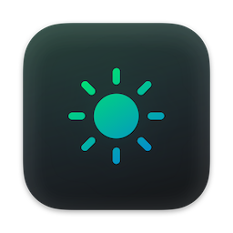

# LADM

This Build is inspired from the DarkModeBuddy.
Automatically switch your Mac between light and dark modes based on the ambient light sensor.

I was a fan of the built-in "Auto" mode on macOS because windows never had this feature at least on the devices that I have used and I felt that that was not having the full functionality which I want It will not switch the Mac to Dark Mode while I'm actively using it in areas where there is not much light or else where there is having more light despite of day or night (which is a problem, since I'm pretty much always using my Mac).

The solution for that is LADM. It's a tiny app that keeps running in the background and reads the ambient light sensor on your Mac (the same one it uses to adjust the brightness of your screen). When the ambient light level falls below the configured value, LADM automatically switches the Mac into Dark Mode. When the ambient light level rises above the configured value, it goes back into Light mode. This does not happen instantaneously: in order to prevent flickering, the change in ambient light level must persist for a certain amount of time, which can also be configured in the app's settings.

# Compatibility

**LADM requires macOS Catalina or later and a Mac with a built-in ambient light sensor. External displays with ambient light sensors are not currently supported.**

# Build

This is a private build. To build locally, open `LADM.xcodeproj` in Xcode and build the `LADM` target.
